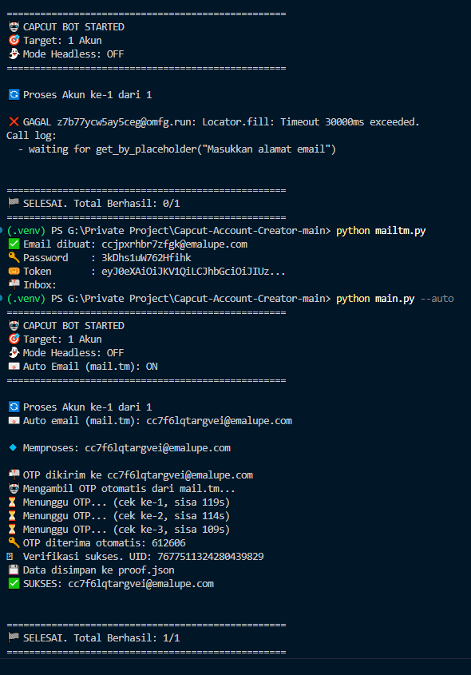

# CapCut Account Maker 🎬

Automation tool untuk membuat akun CapCut secara otomatis menggunakan Playwright. Cocok buat yang males bikin akun satu-satu.

An automation tool that creates CapCut accounts automatically using Playwright. Perfect for anyone who doesn't want to create accounts one by one.

---

## 🌐 Bahasa — Language

- 🇮🇩 [Bahasa Indonesia](#bahasa-indonesia)
- 🇬🇧 [English](#english)

---

<a name="english"></a>
## 🇬🇧 English

### ⚠️ Disclaimer

This tool is built for educational and automation-testing purposes only. Use it responsibly and respect CapCut's Terms of Service. I am not responsible for any misuse of this tool.

### 🚀 Features

- ✅ Auto register CapCut accounts
- ✅ Batch creation (create many accounts at once)
- ✅ Headless mode (runs in the background, browser window is hidden)
- ✅ Secure random password generator
- ✅ Auto-save credentials to JSON
- ✅ Stealth mode (bypass anti-bot detection)
- ✅ Temp mail support
- ✅ **Auto email via [mail.tm](https://mail.tm)** — no need to prepare a manual email list
- ✅ **Auto OTP** — the verification code is fetched automatically from the mail.tm inbox
- ✅ **Auto verification** — verifies the account via the CapCut API and stores the `uid`

### ⚠️ Note about Web Selectors (IMPORTANT)

The web selectors used to target elements on the CapCut page may **differ between countries/regions and may change over time** (CapCut frequently updates their UI). If the tool fails to fill the form, register an account, or read the OTP, the selectors in `main.py` (or `mailtm.py`) probably need to be adjusted. Check the release notes / issues for selector updates.

### 📋 Requirements

- Python 3.8+
- Google Chrome (used by Playwright)
- A stable internet connection

### 🔧 Installation

1. Clone this repository
```bash
git clone https://github.com/baaaaan1/Capcut-Account-Creator.git
cd Capcut-Account-Creator
```

2. Create a virtual environment
```bash
python -m venv .venv
```

3. Activate the virtual environment
```bash
# Windows
.venv\Scripts\Activate.ps1

# Linux/Mac
source .venv/bin/activate
```

4. Install dependencies
```bash
pip install -r requirements.txt
playwright install chromium
```

### 📧 Preparing the Email List (Manual Mode)

> **Skip this section if you use `--auto`** — emails are created automatically via mail.tm.

Create a `gmail-list.txt` file in the project root, filled with a list of emails (one email per line):

```
email1@example.com
email2@example.com
email3@example.com
```

**Recommended Temp Mail Services:**

1. **[Boomlify](https://boomlify.com/)**
2. **[Temp Mail IO](https://temp-mail.io/)**
3. **[NoSpam Today](https://nospam.today/)**
4. **[Email Generator](https://generator.email/)**

> **Tip:** Don't use your real Gmail if you don't want to get banned. Use temp mail instead to stay safe.

### ⚙️ How the Auto Mode Works (mail.tm)

The `--auto` mode uses the [mail.tm API](https://docs.mail.tm/getting-started/authentication) (free, no API key needed):

1. `GET /domains` — fetch an active available domain
2. `POST /accounts` — create a random email account (e.g. `ccx7a2k9@emalupe.com`)
3. `POST /token` — obtain a Bearer token for authentication
4. The script registers to CapCut using that email
5. `GET /messages` — poll the inbox every 5 seconds (max 120 seconds) until the OTP email arrives
6. The 6-digit OTP code is extracted automatically from the email and filled into the form

If the OTP does not arrive within 120 seconds, the script falls back to manual CLI input.

### 🎮 Usage

#### Auto Mode (mail.tm) — Recommended

No need to prepare a `gmail-list.txt`. Emails are created automatically via the [mail.tm API](https://docs.mail.tm/getting-started/authentication) and the OTP is fetched automatically from the inbox:

```bash
python main.py --auto
```

#### Auto Mode + Multiple Accounts + Headless (Fully Automatic)

```bash
python main.py -n 5 --auto --headless
```

#### Create 1 Account (Default, Manual)

```bash
python main.py
```

#### Create Multiple Accounts (Manual)

```bash
python main.py -n 5
```

#### Headless Mode (Background)

```bash
python main.py -n 3 --headless
```

#### Advanced Options

```bash
python main.py --help
```

Output:
```
usage: main.py [-h] [-n NUMBER] [--headless] [--auto]

CapCut Auto Register CLI Tool

options:
  -h, --help            show this help message and exit
  -n NUMBER, --number NUMBER
                        Number of accounts to create (Default: 1)
  --headless            Run the browser in the background (not visible)
  --auto                Auto email via mail.tm (no gmail-list.txt needed) +
                        automatic OTP
```

### 📸 CLI Screenshot

Result of a batch of 3 accounts (auto email via mail.tm + auto OTP + verification):


### 📁 File Structure

```
Capcut-Acc-Maker/
│
├── main.py              # Main script
├── mailtm.py            # Mail.tm API client (auto email + auto OTP)
├── gmail-list.txt       # Email list (created manually, not used in --auto mode)
├── proof.json          # Output credentials (auto-generated)
├── .venv/              # Virtual environment
└── README.md           # This file
```

### 📊 Output Format

Account data is saved to `proof.json`:

```json
[
    {
        "email": "ccx7a2k9@emalupe.com",
        "password": "RMePPubILrp!",
        "birthday": "25/05/2003",
        "uid": "7677513420518622228",
        "verified": true,
        "created_at": "2026-08-24T15:33:52.033104"
    }
]
```

> The `uid` and `verified` fields were added after enabling the account verification feature via the `commerce/v1/subscription/user_info` API.

### 🐛 Troubleshooting

#### Error: gmail-list.txt file not found

Create a `gmail-list.txt` file first in the project folder.

#### Error: Import "playwright" could not be resolved

Reinstall playwright:
```bash
pip install playwright
playwright install chromium
```

#### Browser doesn't open

Check that Chrome is installed. If not:
```bash
playwright install chromium
```

#### OTP doesn't arrive

- In `--auto` mode: the script polls the mail.tm inbox for 120 seconds, then falls back to manual input
- Check the spam folder in the temp mail service
- Wait 30-60 seconds
- If it still doesn't arrive, try another email

#### Error: Failed to create mail.tm email

- Check your internet connection
- mail.tm has a rate limit — the script retries automatically 3 times, but if it still fails wait 1-2 minutes
- mail.tm domains are sometimes blacklisted by CapCut, try again later (active domains can change)

### 💡 Tips & Tricks

1. **Use a VPN** when creating many accounts at once to avoid rate limits
2. **Don't spam** — wait at least 1-2 minutes between accounts
3. **Back up `proof.json`** regularly
4. **Use different temp mails** so you don't get detected as a bot
5. **Headless mode** is faster but harder to debug when an error occurs

### 📝 Known Issues

- Selectors can change (CapCut updates their UI), just adjust them in `main.py`
- OTP sometimes arrives late, be patient
- Some temp mail domains may be blacklisted by CapCut, try another domain

### 🤝 Contributing

Pull requests are welcome! If you find a bug or have an idea for a new feature, feel free to open an issue.

### 📜 License

MIT License — free to use, modify, and distribute. Use it responsibly.

### ☕ Support

If this tool was useful, consider:
- ⭐ Starring this repo
- 🐛 Reporting a bug you found
- 💡 Suggesting a new feature

---

<a name="bahasa-indonesia"></a>
## 🇮🇩 Bahasa Indonesia

### ⚠️ Disclaimer

Tool ini dibuat untuk keperluan edukasi dan testing automation. Gunakan dengan bijak dan patuhi Terms of Service CapCut. Saya tidak bertanggung jawab atas penyalahgunaan tool ini.

### 🚀 Features

- ✅ Auto register akun CapCut
- ✅ Support batch creation (bisa bikin banyak akun sekaligus)
- ✅ Headless mode (background, ga keliatan browser-nya)
- ✅ Random password generator yang aman
- ✅ Auto-save credentials ke JSON
- ✅ Stealth mode (bypass anti-bot detection)
- ✅ Support temp mail
- ✅ **Auto email via [mail.tm](https://mail.tm)** — ga perlu nyiapin list email manual
- ✅ **Auto OTP** — kode verifikasi diambil otomatis dari inbox mail.tm
- ✅ **Auto verifikasi** — akun diverifikasi via API CapCut dan `uid` disimpan

### ⚠️ Catatan tentang Web Selector (PENTING)

Selector web yang dipakai buat narget elemen di halaman CapCut bisa **beda di tiap negara dan bisa berubah sewaktu-waktu** (CapCut sering update UI-nya). Kalau tool gagal ngisi form, daftar akun, atau baca OTP, kemungkinan besar selector di `main.py` (atau `mailtm.py`) perlu di-adjust. Cek release notes / issues buat update selector.

### 📋 Requirements

- Python 3.8+
- Google Chrome (dipakai Playwright)
- Koneksi internet yang stabil

### 🔧 Installation

1. Clone repo ini
```bash
git clone https://github.com/baaaaan1/Capcut-Account-Creator.git
cd Capcut-Account-Creator
```

2. Buat virtual environment
```bash
python -m venv .venv
```

3. Aktifkan venv
```bash
# Windows
.venv\Scripts\Activate.ps1

# Linux/Mac
source .venv/bin/activate
```

4. Install dependencies
```bash
pip install -r requirements.txt
playwright install chromium
```

### 📧 Nyiapin Email List (Mode Manual)

> **Skip bagian ini kalo pake `--auto`** — email dibuat otomatis via mail.tm.

Buat file `gmail-list.txt` di root folder, isi dengan list email (satu email per baris):

```
email1@example.com
email2@example.com
email3@example.com
```

**Rekomendasi Temp Mail Services:**

1. **[Boomlify](https://boomlify.com/)**
2. **[Temp Mail IO](https://temp-mail.io/)**
3. **[NoSpam Today](https://nospam.today/)**
4. **[Email Generator](https://generator.email/)**

> **Tips:** Jangan pake gmail asli lu kalo ga mau kena ban. Pake temp mail aja biar aman.

### ⚙️ Cara Kerja Mode Auto (mail.tm)

Mode `--auto` memakai [mail.tm API](https://docs.mail.tm/getting-started/authentication) (gratis, tanpa API key):

1. `GET /domains` — ambil domain aktif yang tersedia
2. `POST /accounts` — buat akun email acak (misal `ccx7a2k9@emalupe.com`)
3. `POST /token` — dapatkan Bearer token untuk autentikasi
4. Script daftar ke CapCut pakai email tersebut
5. `GET /messages` — polling inbox tiap 5 detik (maks 120 detik) sampai email OTP masuk
6. Kode OTP 6 digit diekstrak otomatis dari isi email dan diisi ke form

Kalo OTP ga masuk dalam 120 detik, script fallback ke input manual via CLI.

### 🎮 Usage

#### Mode Auto (mail.tm) — Recommended

Ga perlu nyiapin `gmail-list.txt`. Email dibuat otomatis via [mail.tm API](https://docs.mail.tm/getting-started/authentication) dan OTP diambil otomatis dari inbox:

```bash
python main.py --auto
```

#### Auto Mode + Multiple Akun + Headless (Full Otomatis)

```bash
python main.py -n 5 --auto --headless
```

#### Bikin 1 Akun (Default, Manual)

```bash
python main.py
```

#### Bikin Multiple Akun (Manual)

```bash
python main.py -n 5
```

#### Headless Mode (Background)

```bash
python main.py -n 3 --headless
```

#### Advanced Options

```bash
python main.py --help
```

Output:
```
usage: main.py [-h] [-n NUMBER] [--headless] [--auto]

CapCut Auto Register CLI Tool

options:
  -h, --help            show this help message and exit
  -n NUMBER, --number NUMBER
                        Jumlah akun yang ingin dibuat (Default: 1)
  --headless            Jalankan browser di background (tidak terlihat)
  --auto                Auto email via mail.tm (tidak perlu gmail-list.txt) +
                        OTP otomatis
```

### 📸 Screenshot CLI

Hasil batch 3 akun (auto email via mail.tm + auto OTP + verifikasi):


### 📁 File Structure

```
Capcut-Acc-Maker/
│
├── main.py              # Script utama
├── mailtm.py            # Mail.tm API client (auto email + auto OTP)
├── gmail-list.txt       # List email (dibuat manual, tidak dipakai di mode --auto)
├── proof.json          # Output credentials (auto-generated)
├── .venv/              # Virtual environment
└── README.md           # File ini
```

### 📊 Output Format

Data akun tersimpan di `proof.json`:

```json
[
    {
        "email": "ccx7a2k9@emalupe.com",
        "password": "RMePPubILrp!",
        "birthday": "25/05/2003",
        "uid": "7677513420518622228",
        "verified": true,
        "created_at": "2026-08-24T15:33:52.033104"
    }
]
```

> Field `uid` dan `verified` baru ada setelah diaktifkan fitur verifikasi akun via API `commerce/v1/subscription/user_info`.

### 🐛 Troubleshooting

#### Error: File gmail-list.txt tidak ditemukan

Buat file `gmail-list.txt` dulu di folder project.

#### Error: Import "playwright" could not be resolved

Install ulang playwright:
```bash
pip install playwright
playwright install chromium
```

#### Browser ga kebuka

Cek Chrome udah terinstall atau belum. Kalo belum:
```bash
playwright install chromium
```

#### OTP ga masuk

- Mode `--auto`: script otomatis polling inbox mail.tm selama 120 detik, lalu fallback ke input manual
- Cek folder spam di temp mail
- Tunggu 30-60 detik
- Kalo masih ga masuk, coba email lain

#### Error: Gagal membuat email mail.tm

- Cek koneksi internet
- mail.tm punya rate limit — script otomatis retry 3x, tapi kalo masih gagal tunggu 1-2 menit
- Domain mail.tm kadang diblacklist CapCut, coba lagi nanti (domain aktif bisa berubah)

### 💡 Tips & Tricks

1. **Pake VPN** kalo bikin banyak akun sekaligus biar ga kena rate limit
2. **Jangan spam** - kasih jeda minimal 1-2 menit per akun
3. **Backup `proof.json`** secara berkala
4. **Pake temp mail yang beda-beda** biar ga kedetect sebagai bot
5. **Headless mode** lebih cepat tapi susah debug kalo error

### 📝 Known Issues

- Kadang selector CapCut berubah (mereka update UI), tinggal adjust aja di `main.py`
- OTP kadang telat masuk, sabar aja
- Beberapa domain temp mail mungkin diblacklist sama CapCut, coba domain lain

### 🤝 Contributing

Pull request welcome! Kalo nemu bug atau ada ide fitur baru, feel free buat bikin issue.

### 📜 License

MIT License - bebas pake, modif, distribute. Tapi pake dengan bijak.

### ☕ Support

Kalo tool ini berguna, consider buat:
- ⭐ Star repo ini
- 🐛 Report bug yang lu temuin
- 💡 Suggest fitur baru

---

**Dibuat dengan ☕**
